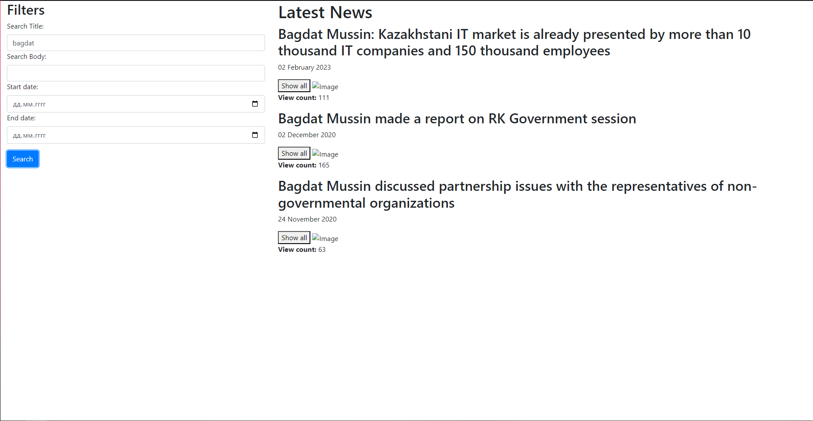
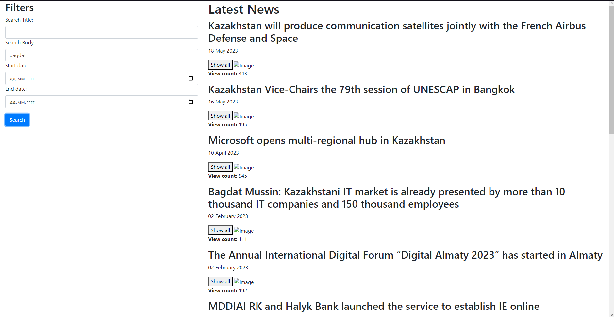
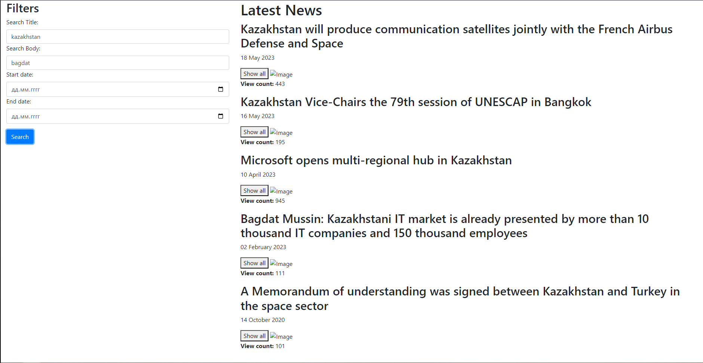
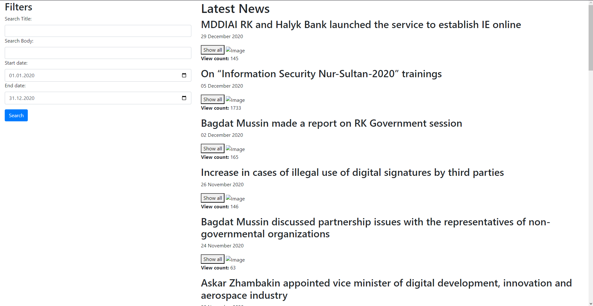
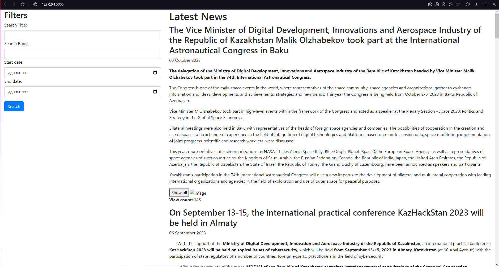

Приветствую!

Меня зовут Сериков Нурсултан, я студент второго курса Astana IT University.

Это мое решение на тестовое задание.

Стэк для решения данной проблемы таков:

Python + Flask для работы с API

HTML + BOOTSTRAP + Javascript

Теперь по порядку.

Бутстрап был использован создания грида, т.е. разделения области на две части: фильтр и листер. Также бутстрап был использован для создания раскрывашки. Заодно благодаря нему использовал внутренний стайлинг бутстрапа, в связи с чем CSS в данном проекте отсутсвует.

Джаваскрипт в свою же очередь используется для сортировки и фильтра. 

Пайтон в связке с Фласком был использован для более быстрой и облегченной работы с API, а также, поскольку вся задача состоит только из одной страницы, Фласк является наиболее идеальным решением данной проблемы.

В репозитории вы также можете найти файл "test.py". Он был мною использован для того чтобы прочитать содержимое JSON, понять как и что можно использовать, найти более грамотный подход.

Запустить проект можно с файла "app.py". Оттуда перейдите по http://127.0.0.1:5000 и можете смотреть проект. В случае чего готов подсказать и объяснить что-либо!

Ниже вы можете посмотреть скриншоты веб-сайта

